# Brightsign-Plex-Slideshow
Repurposing an old Brightsign into a personal screensaver with Plex integration

**Why**  
I ended up with an old Brightsign player (specifically XT243) that was no longer needed or supported (professionally). Figuring I can put it to some good use, I turned it into a slideshow player that would look cool as a background.

This repo is not a "deploy" and done... It is a collection of the various files and configs I needed to put this project together. This repo is mostly so I can remember and refer back. The specifics will vary according to your network and configuration(s).

---

## TLDR
This boils down to having a web server on a NAS serve a slideshow webpage — cycling through wallpapers and overlaying a "Now Playing" card when Plex is active — and pointing an old BrightSign player at that URL so it displays on a dedicated monitor.
- **NAS** hosts the images, runs a Python poller every minute to check Plex, and serves the `index.html` slideshow page
- **BrightSign** acts as a dumb browser: boots up, loads the URL, and plays the slideshow indefinitely

## Table of Contents
- [Repo Structure](#repo-structure)
- [All the ticky-tacky pieces needed](#all-the-ticky-tacky-pieces-needed)
- [Synology NAS](#synology-nas)
- [Plex Token Gathering](#plex-token-gathering)
- [BrightSign: Firmware & Setup](#brightsign-firmware--setup)
- [BrightSign: Creating the Presentation](#brightsign-creating-the-presentation)
- [Future Improvements](#future-improvements)

---

## Repo Structure
```
├── NAS
│   └── slideshow                  ← copy this folder to the Synology
│       ├── generate_manifest.sh
│       ├── images.json
│       ├── index.html
│       ├── plex_poller.py
│       ├── plex-status.json
│       └── images
│           └── wallpaper-*.jpg    (10 samples — add your own here)
└── reference
    ├── BAConnected-Save           ← BA Connected project files for the BrightSign
    │   └── plexslideshow
    │       ├── plexslideshow.bpfx
    │       └── autoschedule.bpsx
    └── screenshots                ← setup screenshots referenced in this README
```

---

## All the ticky-tacky pieces needed
| Item | What | Why / Purpose |
| --- | --- | --- |
| Display | old 24" 1920x1080 monitor | Unused monitor that was collecting dust. Not really sharp enough anymore to be used for up-close working text. |
| NAS | Synology | In reality, doesn't really matter. Just need a simple webserver, storage, and something to execute the Python script on a regular basis. Given that this is a "set-up-and-forget" type project, I wanted something that will just work. |
| Player | Brightsign XT243 | Very small, very old Brightsign player that was no longer needed / supported. It was in production for about 5 years (running 24/7) — so I have to assume the onboard storage is about used up. It got a fresh SD card and a firmware update for this project. |
| BA Connected | Brightsign authoring software | Used to upgrade the player firmware, base config, and base Presentation. Mostly just default / minimal settings. Be sure to get the version that works for your OS. In my case, only BA Connected works on macOS. No, I did not connect it to their online service — it will work locally just fine (with a little complaining). v1.85.0 used. https://www.brightsign.biz/resources/software-downloads/ |

---

Here we go!

---

## Synology NAS
This is the heart and engine of it all. The NAS acts as the webserver, storage, and also runs the `plex_poller.py` script every 60 seconds to update the `plex-status.json` file. We need a minimal Python install on the system to run the scripts. For me, I chose to run things on a non-standard port of 9001 (192.168.XXX.XXX:9001).

Setting up the Synology involves creating a web-accessible folder structure, installing and configuring Web Station, granting the necessary permissions, and scheduling the `plex_poller.py` script to run every minute via Task Scheduler.

1) Need a large(ish) stash of wallpapers. This will be running all day — the more the better. I already had a large collection of pictures and then augmented it by hitting various wallpaper websites. All told, I have about 4300 pictures and will add / curate as needed. Note: these images are NOT included in the repo (except for the random 10 included as examples).
2) Create a folder on the Synology (root in this case) with the following sub-folders and copy the files into their respective folders:
    - /photo/
    - /photo/slideshow
        - `generate_manifest.sh`
        - `images.json`
        - `index.html`
        - `plex_poller.py`
        - `plex-status.json`
    - /photo/slideshow/images
        - _all the images_

3) Install the included "Web Station"
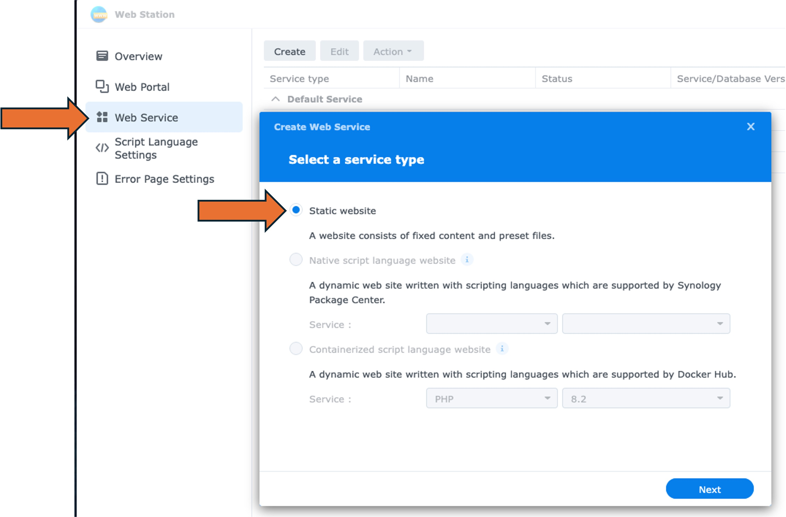
    - Synology Package Manager -> Web Station -> Install
4) Create a new Web Service
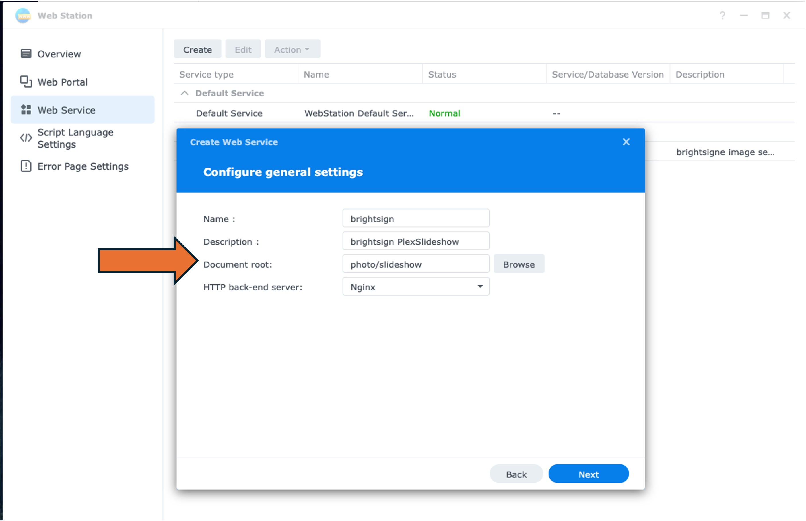
    - "static"
    - Name it, add a description
    - document root (browse) photo/slideshow
    - "create" and save
5) Go to the Web Portal menu item
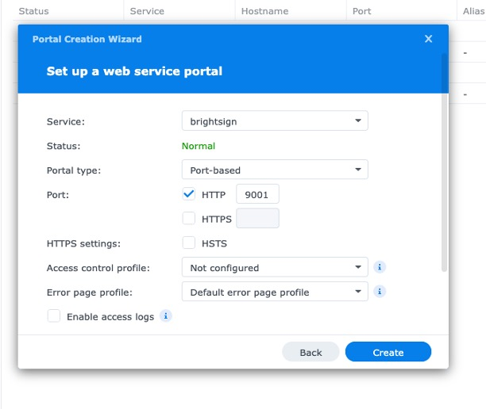
    - "create" -> "Web Service Portal"
    - Select the service we created in the previous step
    - Portal Type: Port-based
        - check **HTTP** and fill in port **9001**
    - Allow Synology to adjust the permissions and fill out the other required information (name, etc.)
6) Set up additional permissions on /photo/slideshow
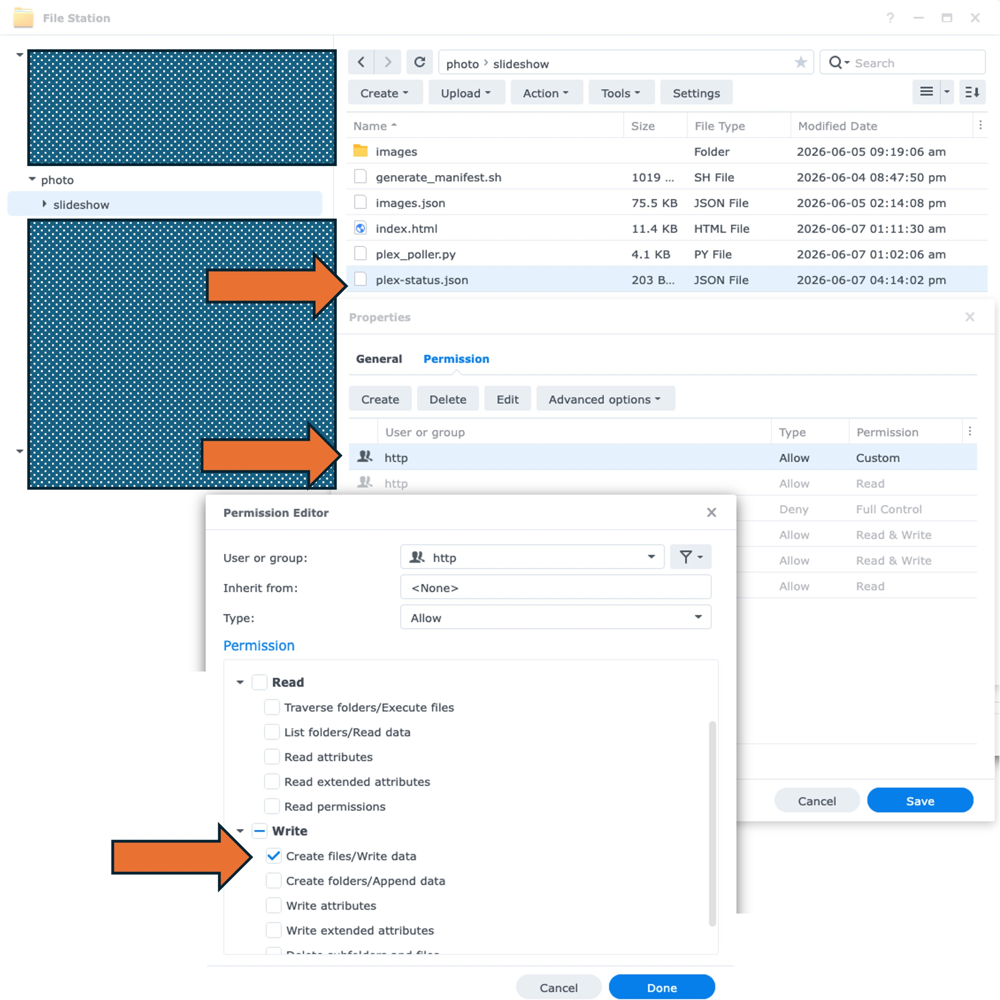
    _Note: We will be executing `plex_poller.py` via the Synology Task Scheduler — so the http user needs write permissions._

    - "File Station" -> navigate to `/photo/slideshow/plex-status.json`
    - Grant system user "http" the "WRITE" permission on `plex-status.json`. This is applied on top of the existing "READ" access.
7) We need Python on the Synology. The Synology packages have Python 3.9 available OR you can install the community packages and select a newer version. I chose to install the Python 3.14 Community package — this will change the command line in the Task Scheduler step so you execute the right Python version. Double check with SSH / terminal to get the paths.
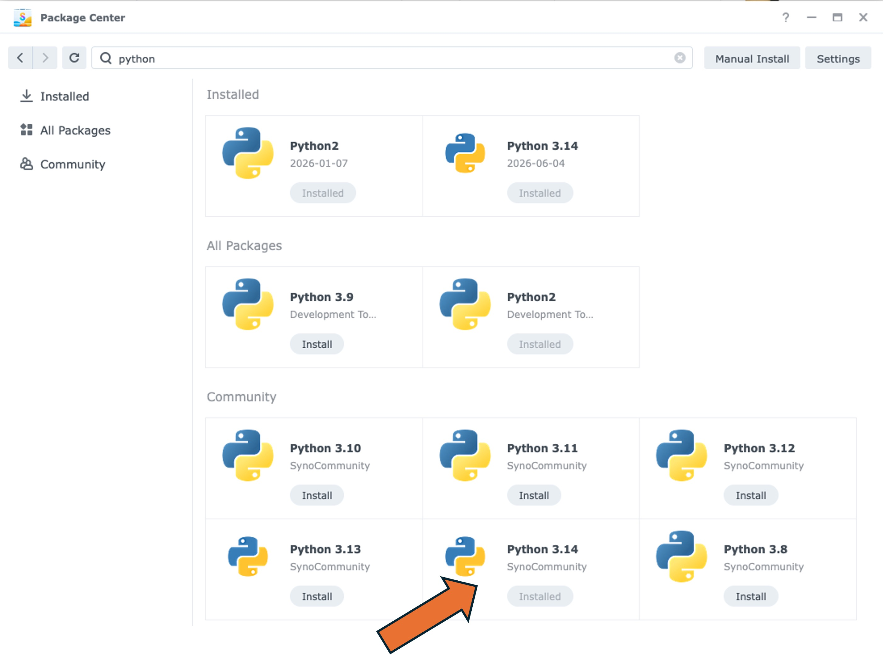
8) Set up `plex_poller.py` under Task Scheduler
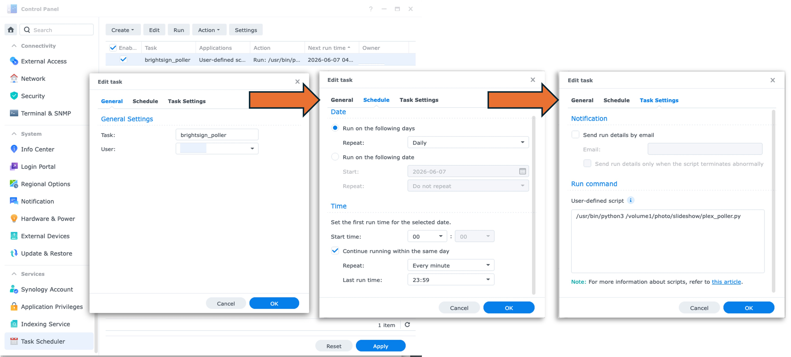
    - Control Panel -> Task Scheduler
    - Fill in task name
    - Select a user with the proper permissions
    - Set the schedule -> daily, every day, every minute
    - User defined script — include the full path to the Python executable and the `plex_poller.py` script. Example:
    ``` /usr/bin/python3 /volume1/photo/slideshow/plex_poller.py ```
9) Edit `plex_poller.py` and fill in your PLEX_TOKEN, PLEX_USER, PLEX_HOST, and OUTPUT_FILE
10) Generate the manifest by running `generate_manifest.sh`
11) Test with a web browser — head to http://192.168.XXX.XXX:9001
You should see a webpage. We still need to configure and point the BrightSign player at this URL before the slideshow will appear on the display.

---

## Plex Token Gathering
You need your Plex Token and Username. This is how `plex_poller` knows what to query.

1) Open Plex via a web browser
2) Click into any media file
3) While the media is playing, right-click on the lower panel to **INSPECT**
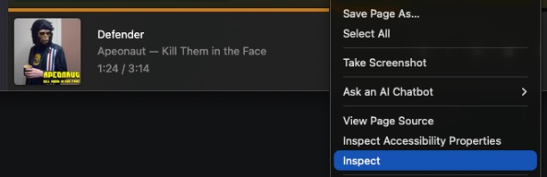
4) Search in the HTML code for "plex-token="
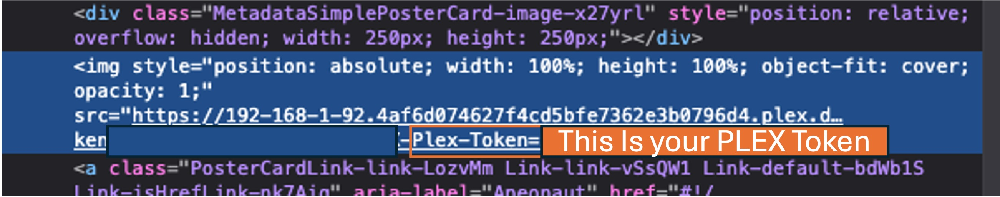
5) Copy the 20 characters that come after the "=" sign. It is embedded in nearly all the media pages — just need to look for it.

---

## BrightSign: Firmware & Setup
For best, reproducible results, start by updating the firmware before creating a presentation. Launch BA Connected and connect to the player.

1) Open **Firmware & Settings**
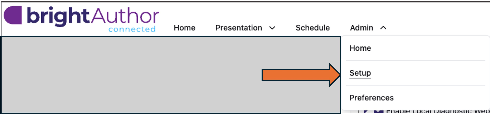
2) Select the firmware version to install
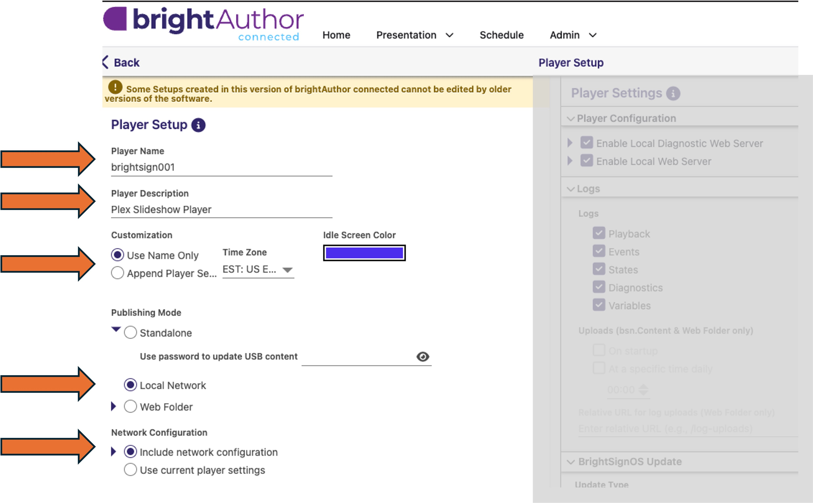
3) Configure the base device settings (network, name, etc.)
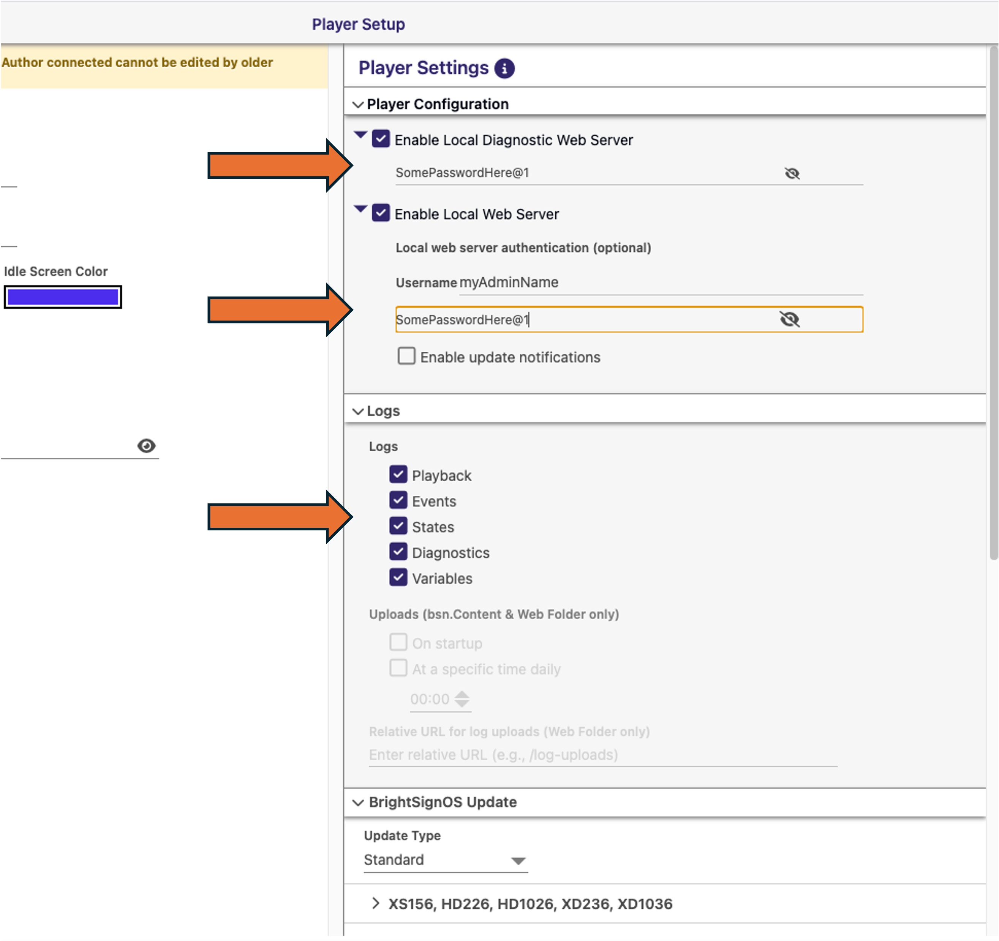
4) Click **Save** and choose an output folder — BA Connected will write ~140–150 MB of files
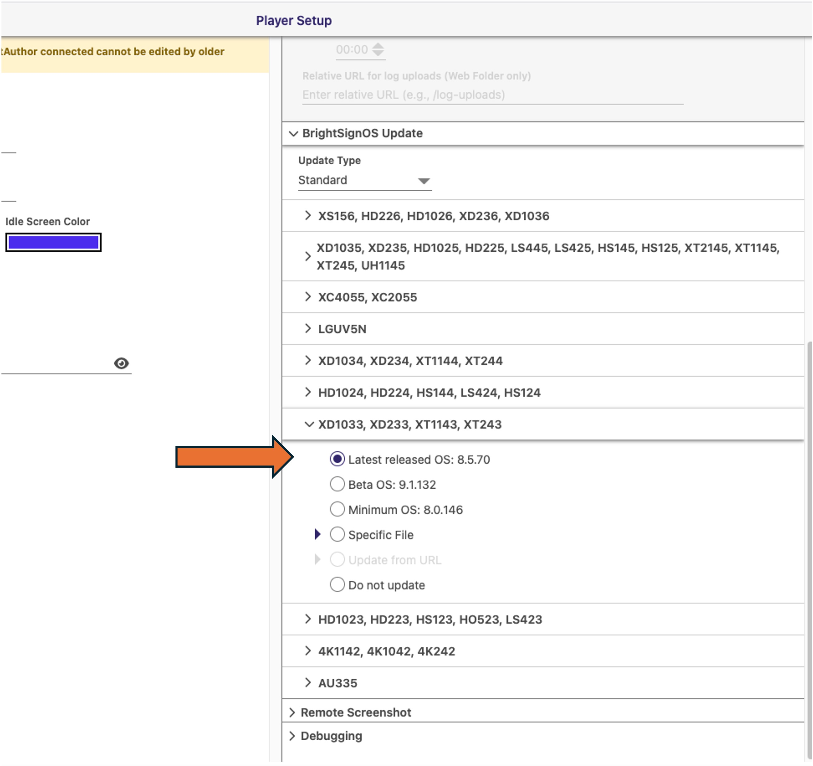

Copy **all** of the output to the root of the SD card (overwriting anything else). Insert the SD card into the BrightSign and power it on. The player will boot, upgrade its firmware, and apply the configuration — this can take 5–10 minutes. Once it reaches a ready/idle state it's set for the next step.

---

## BrightSign: Creating the Presentation
With the player on the network and in an idle state, create and publish the presentation via BA Connected.

1) Go to **Presentation → New**
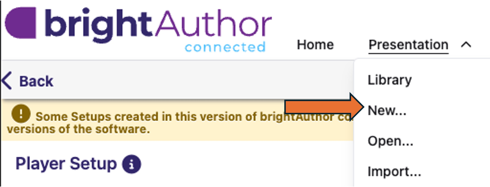
2) Choose **HTML5** as the content type and set the URL to your NAS slideshow address (e.g. `http://192.168.XXX.XXX:9001`). Set the display resolution to match your monitor (1920×1080).
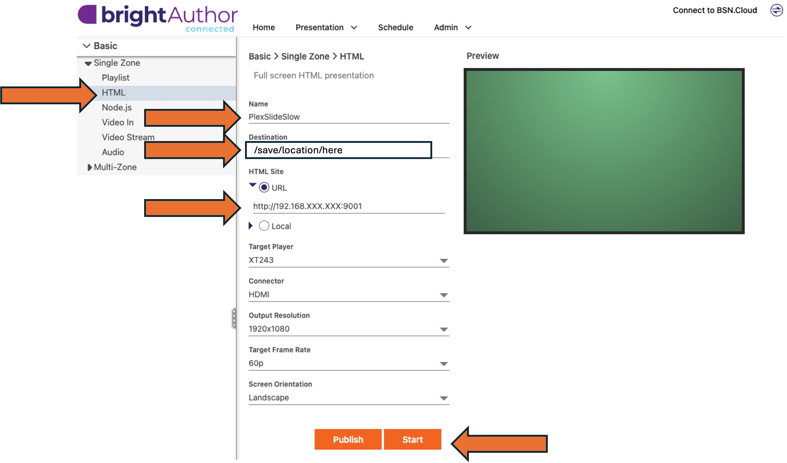
3) Configure autoplay so the presentation launches on power-up
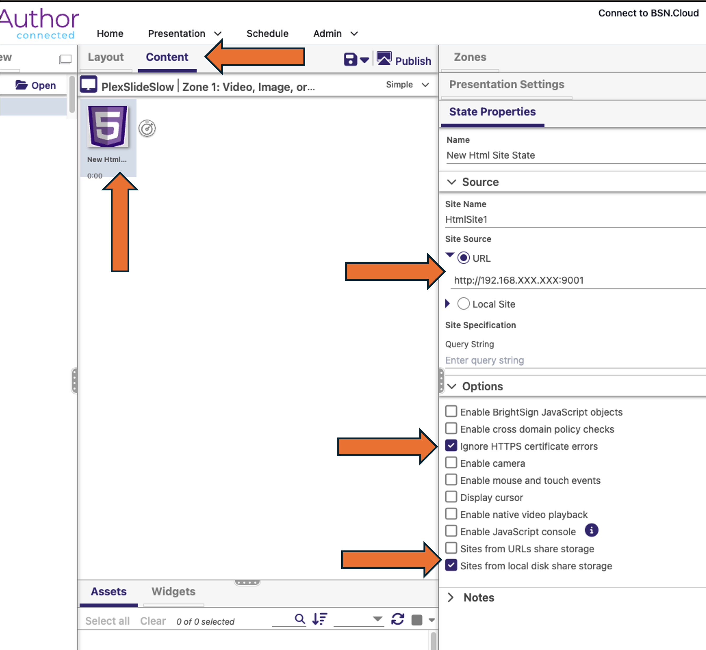
4) Set the publish schedule
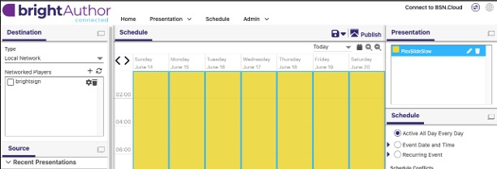
5) Add / connect to the BrightSign player and publish
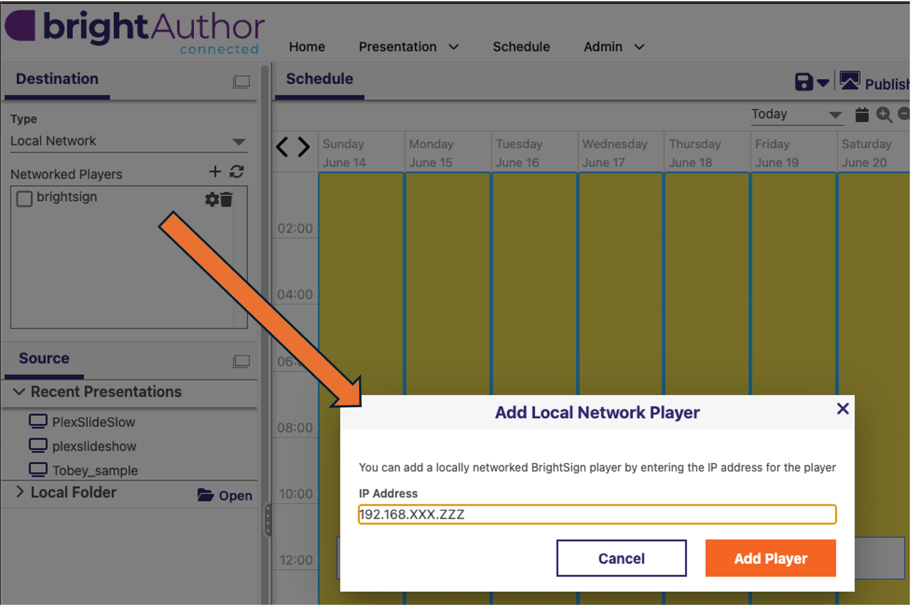

The player will reboot and launch the slideshow — done!

_The BA Connected project files are saved in this repo under `/reference/BAConnected-Save/` for reference._

---

## Future Improvements
What I have now works and meets the goals I set out for initially. As with all projects, as you get into the weeds, more ideas and integrations pop up. Some that came to mind:
- Dynamic wallpapers related to the content playing on Plex
- Auto download / feed of wallpapers
- Show multiple cards if multiple streams are playing at the same time
- Fancier web server service
- HTTPS / SSL for the connection
